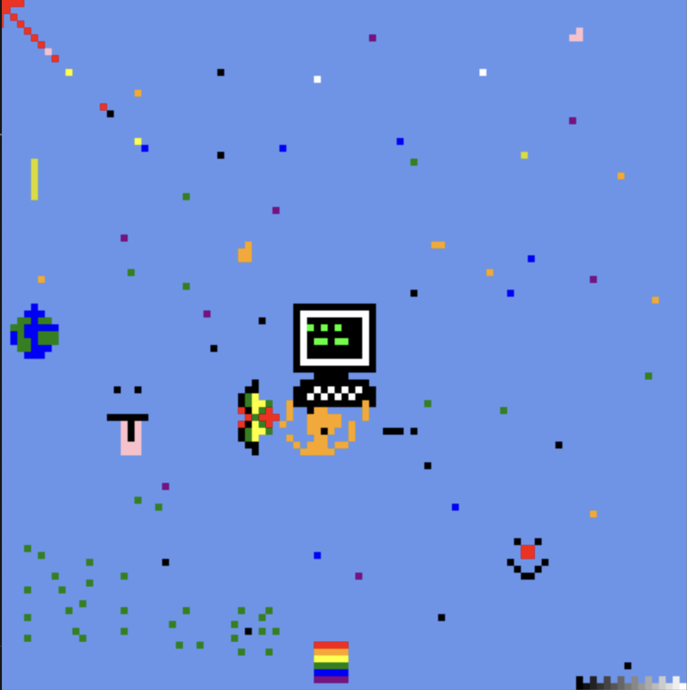

# rc-place
[](https://goreportcard.com/report/github.com/jobin212/rc-place) [](https://www.gnu.org/licenses/agpl-3.0) 


A place for [Recursers](https://www.recurse.com) to color pixels, inspired by
[r/place](https://www.reddit.com/r/place/). For architecture details, see [How We Built r/Place
](https://www.redditinc.com/blog/how-we-built-rplace).



## Build and Run
Create an OAuth application at [https://www.recurse.com/settings/apps](https://www.recurse.com/settings/apps) with proper redirect URI (http://localhost:8080/auth for local run).
**Make sure to set your app's ID, Secret, and Redirect URI in your environmental variables** (see [.env.example](.env.example)). You can optionally set your own redis host and password.

```shell
# Load your environmental variables after setting them
🎨 source .env.example

# Run Redis via docker container
🎨 docker run --name rc-place-redis -d -p 6379:6379 redis

# Run rc-place app
🎨 make run
```
🎉 rc-place should now be running at [http://localhost:8080](http://localhost:8080)

## Other tools

```shell
# Use Redis docker
🎨 docker exec -it rc-place-redis redis-cli

# Reset board
🎨 del $REDIS_BOARD_KEY 

# Get board at offset (x + boardSize*y)
🎨 bitfield $REDIS_BOARD_KEY GET u4 #$OFFSET
```

## Deploy
```shell
🎨 fly deploy
```

## Rest API

### Update Tile
----
Update the color of a tile located at column x, row y.
* **URL:** /tile
* **Method:** `POST`
* **Data Params:**

Request Body
```json
{
    "x": 2,
    "y": 4,
    "color": "red"
}
```
Valid colors: `black`, `forest`, `green`, `lime`, `blue`, `cornflowerblue`, `sky`, `cyan`, `red`, `burnt-orange`, `orange`, `yellow`, `purple`, `hot-pink`, `pink`, `white`.

* **Success Response:** 200
* **Error Response**
  * **Code** 400 Bad Request <br />
    * Invalid json body: make sure you're using the right types, valid colors, and your body is encoded correctly.
  * **Code** 401 Unauthorized <br />
    * Make sure you have a valid personal access token in your authorization header.
  * **Code** 425 Too Early <br />
    * There's a time limit for sending requests, make sure to wait one second between requests.
  * **Code** 500 Internal Server Error <br />
    * You may have found a bug! You're encouraged to [file an issue on github](https://github.com/jobin212/rc-place/issues/new) with the steps to reproduce.

* **Sample Call**
```shell
🎨 curl -X POST http://localhost:8080/tile -H "Content-Type: application/json" -d '{"x": 3, "y": 3, "color": "red"}' -H "Authorization: Bearer $PERSONAL_ACCESS_TOKEN"
```

### Get tiles
----
Get all tiles.
* **URL:** /tiles
* **Method:** `GET`
* **Success Response:** 200
```json 
{
  "tiles" : [[1, 2], [3, 4]],
  "height": 2,
  "width": 2,
  "updateLimitInMs": 10
}
```
Note updateLimit is the update limit in milliseconds.
* **Error Response**
  * **Code** 401 Unauthorized <br />
    * Make sure you have a valid personal access token in your authorization header.
  * **Code** 500 Internal Server Error <br />
    * You may have found a bug! You're encourage to file an issue with the steps to reproduce.

* **Sample Call**
```shell
🎨 curl http://localhost:8080/tiles -H "Authorization: Bearer $PERSONAL_ACCESS_TOKEN"
```

### Get tile
----
Get a tile.
* **URL:** /tile
* **Method:** `GET`
* **Data Params:**

Query Parameters
  - x: column
  - y: row

Constraints:
- 0 <= x < BOARD_SIZE
- 0 <= y < BOARD_SIZE
* **Success Response:** 200
```json
{
  "color" : "red",
  "x": 2,
  "y": 2,
  "lastUpdated":"2022-03-29T00:56:58.632329-04:00",
  "lastEditor":"3731-joseph-tobin"
}
```
* **Error Response**
  * **Code** 400 Bad Request <br />
    * Invalid query parms: make sure you're using the valid query parameters within boundaries.
  * **Code** 401 Unauthorized <br />
    * Make sure you have a valid personal access token in your authorization header.
  * **Code** 500 Internal Server Error <br />
    * You may have found a bug! You're encourage to file an issue with the steps to reproduce.

* **Sample Call**
```shell
🎨 curl http://localhost:8080/tile?x=15&y=3 -H "Authorization: Bearer $PERSONAL_ACCESS_TOKEN"
```